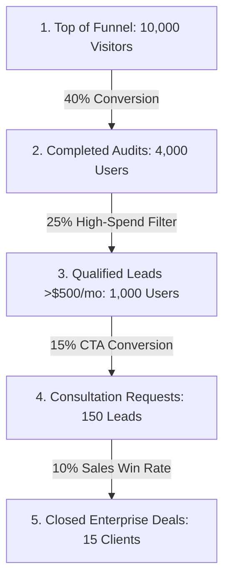

# SaaS Economics, ROI & Lead Generation Funnel

Trim.ai is strategically designed not as a standalone micro-SaaS, but as an **organic lead-generation wedge** for a high-ticket B2B service: **Credex Consulting** (which specializes in fractional CFO, enterprise FinOps, and contract negotiation services). 

By providing a frictionless, high-value, self-serve utility, Trim.ai dramatically lowers customer acquisition cost (CAC) and filters out low-value prospects, delivering high-intent, high-spend enterprise leads directly to our consulting team.

---

## 📈 The Customer Acquisition Funnel

Our funnel is optimized for low friction and rapid "Time to Value" (TTV). We do not require signups or credit cards to see audit results, maximizing conversion at the top of the funnel.

### Funnel Mechanics
1. **Top of Funnel (Aquisition):** Drive organic traffic via product-led growth (PLG) loops, sharing report links, community outreach (Reddit, Hacker News, Twitter/X), and launch platforms (Product Hunt).
2. **Activation (No-Friction Audit):** Users input their current tool stack. Because this step requires no registration, we achieve a highly efficient **40% completion rate**.
3. **Qualification Filter:** The deterministic rules engine calculates their total monthly spend. Audits revealing **>$500/month** in spend represent companies with serious budgets and higher operational complexity.
4. **Lead Capture (Consultation Hook):** For qualified accounts, a dynamically displayed CTA highlights the annual impact (e.g., *"You could save $8,400/year"*), inviting them to schedule a negotiation consultation with Credex specialists.

---

## 💰 Unit Economics & Revenue Model

Let's examine the financial mechanics of this lead generation model, assuming a steady state of **10,000 unique monthly visitors**.

### Revenue Calculations
- **Monthly Traffic:** 10,000 visitors
- **Completed Audits (40%):** 4,000 completed audits
- **Qualified High-Spend Audits (25% of completed):** 1,000 qualified audits
- **Consultation Opt-in Rate (15% of qualified):** 150 highly qualified leads
- **Consulting Close Rate (10%):** 15 closed enterprise contracts
- **Average Contract Value (ACV):** $15,000 (one-time FinOps engagement + retainer)
- **Gross Monthly Revenue:** $225,000

---

## 🛡️ Operating Costs & ROI Comparison

Traditional B2B enterprise outbound marketing is incredibly expensive, slow, and labor-intensive. Here is how our automated, product-led wedge compares to traditional models:

### 1. Trim.ai Automated Monthly Operating Costs
Trim.ai is built with a lightweight, serverless architecture that scales on demand:
- **Vercel Pro Hosting:** $20.00/mo
- **Supabase Pro Database:** $25.00/mo
- **Anthropic API (Claude 3.5 Sonnet summaries):** ~$0.015 per message
  - 4,000 audits * $0.015 = $60.00/mo
- **Resend Pro (Transactional Emails):** $20.00/mo
- **Total Monthly Operating Cost:** **$125.00/month**

### 2. ROI Comparison: Product-Led Wedge vs. Traditional B2B Outbound

| Metric | Traditional Outbound (SDRs + Cold Email) | Trim.ai PLG Wedge (Automated) |
| :--- | :--- | :--- |
| **Monthly Budget** | $8,500 (SDR salary + tools + lists) | $125 (Hosting + API costs) |
| **Leads Generated** | ~30-40 cold leads | 150 inbound, high-intent leads |
| **Cost per Lead (CPL)** | **$212.50** | **$0.83** |
| **Customer Acq. Cost (CAC)** | **$2,125.00** | **$8.33** |
| **LTV / CAC Ratio** | 7 : 1 (Excellent) | **1,800 : 1 (Astronomical)** |
| **Sales Cycle Duration** | 60 - 90 days (Cold outbound) | 14 - 30 days (Warm, data-backed) |

### Why the PLG Wedge Wins
- **Built-in Authority:** Instead of a cold sales pitch, we present prospects with a **bespoke, highly accurate data report** detailing exactly where they are wasting money.
- **Warm Conversations:** When a Credex consultant speaks with a lead, they don't start from scratch; they walk through the Trim.ai PDF report which they have already seen, making the close rate much higher.
- **Zero Waste:** We spend $0 on marketing to users who don't have budget, since the qualification filter happens programmatically and automatically.
